# SimpleViews

**The simplest possible Android UI components for the classic View/XML world.**
Load images from a URL right in XML. Build lists without adapters. Stack children
without `layout_width`, `layout_height` or margins. Rounded corners without a
single drawable file. No Material Components dependency.

> SimpleViews makes XML Views feel as easy as Compose should. It is built for
> students, first-time Android engineers, and teams maintaining XML-based apps.

| | |
|---|---|
| Image loading | [Coil 3](https://github.com/coil-kt/coil) |
| Rounded corners / ripples | framework `GradientDrawable` / `RippleDrawable` / `ViewOutlineProvider` — no extra libraries |
| Minimum SDK | 23 |
| Distribution | [JitPack](https://jitpack.io) |

---

## Install

**Step 1.** Add JitPack to `settings.gradle.kts`:

```kotlin
dependencyResolutionManagement {
    repositories {
        google()
        mavenCentral()
        maven("https://jitpack.io")
    }
}
```

**Step 2.** Add the dependency:

```kotlin
dependencies {
    implementation("com.github.KevinLay689:SimpleViews:1.0.0")
}
```

Your app manifest needs `<uses-permission android:name="android.permission.INTERNET" />`
for the network components (`UrlImageView`, `AvatarView`, `ImagePage`, `SimpleWebView`).

---

## 60-second tour

```xml
<!-- A web image, right in XML -->
<com.github.simpleviews.UrlImageView
    android:layout_width="match_parent"
    android:layout_height="200dp"
    app:svLoad="https://picsum.photos/800/400" />
```

```xml
<!-- A vertical stack: children need no width/height/margins -->
<com.github.simpleviews.VStack
    android:layout_width="match_parent"
    android:layout_height="wrap_content"
    android:padding="16dp"
    app:svSpacing="12dp">

    <TextView android:text="Title"
        android:layout_width="wrap_content" android:layout_height="wrap_content" />
    <Button android:text="Continue"
        android:layout_width="wrap_content" android:layout_height="wrap_content" />
</com.github.simpleviews.VStack>
```

```kotlin
// A working, tappable list — no adapter, no ViewHolder, no LayoutManager:
list.items = listOf("Mercury", "Venus", "Earth")
```

---

## Contents

1. [Images](#images) — UrlImageView, AvatarView
2. [Buttons & inputs](#buttons--inputs) — SimpleButton, PasswordEditText, ValidatingEditText
3. [Containers & feedback](#containers--feedback) — SimpleCard, BannerView, EmptyStateView, CenterLayout, SafeLayout
4. [Layout stacks](#layout-stacks) — VStack, HStack, ScrollVStack
5. [Pre-built page templates](#pre-built-page-templates) — ImagePage, TitlePage, ProfileHeader, ListItemView, SectionHeader, KeyValueRow, BottomActionBar
6. [Lists](#lists) — SimpleList
7. [Other views](#other-views) — HtmlTextView, SimpleWebView
8. [Kotlin helpers](#kotlin-helpers)
9. [The svExactSize escape hatch](#the-svexactsize-escape-hatch)
10. [Design decisions](#design-decisions)
11. [Sample app](#sample-app)
12. [Publishing your fork](#publishing-your-fork)

---

## Images

### UrlImageView

Loads a web URL into an ImageView, declared entirely in XML. Coil handles
caching, placeholders and the activity lifecycle. Circle/rounded clipping is
done with outline providers — so **placeholders and error images get clipped
too**, not just the downloaded bitmap.


```xml
<com.github.simpleviews.UrlImageView
    android:layout_width="match_parent"
    android:layout_height="200dp"
    app:svLoad="https://example.com/photo.jpg"
    app:svRounded="16dp"
    app:svPlaceholder="@drawable/photo_placeholder"
    app:svError="@drawable/photo_error"
    app:svAlt="Photo of a mountain" />
```

```kotlin
val view = findViewById<UrlImageView>(R.id.image)
view.url = "https://example.com/photo.jpg"   // same code path as the attribute
view.loadUrl("https://example.com/other.jpg")
```

| Attribute | Type | Default | Description |
|---|---|---|---|
| `svLoad` | string | — | The URL to load |
| `svPlaceholder` | reference | — | Drawable shown while loading |
| `svError` | reference | — | Drawable shown when loading fails |
| `svCircle` | boolean | false | Clip to a circle (use a square view) |
| `svRounded` | dimension | — | Corner radius in dp |
| `svAlt` | string | — | Accessibility text (sets `contentDescription`) |
| `svCrossfade` | boolean | true | Crossfade animation when the image arrives |

Notes:
- `svCircle` and `svRounded` are mutually exclusive; `svCircle` wins.
- Always give the view explicit size — 200dp tall, or 1:1 for circles.
- The layout preview shows a placeholder image; no network call happens there.

### AvatarView

A circular avatar with an optional border ring. Shows a friendly person
placeholder until a URL is set, so empty profiles never look broken.

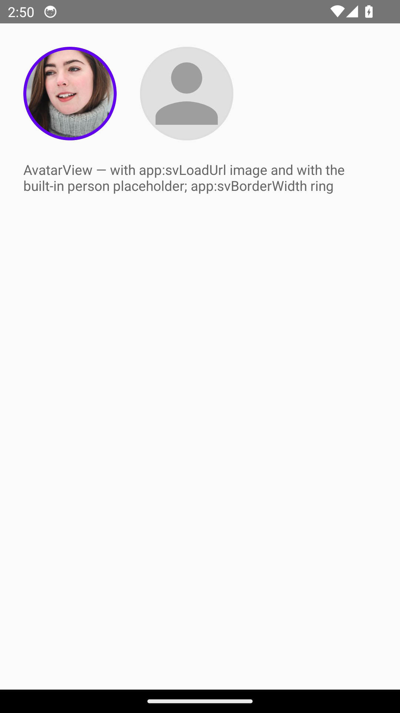

```xml
<com.github.simpleviews.AvatarView
    android:layout_width="56dp"
    android:layout_height="56dp"
    app:svLoad="https://example.com/me.jpg"
    app:svBorderWidth="2dp"
    app:svBorderColor="@android:color/white" />
```

| Attribute | Type | Default | Description |
|---|---|---|---|
| `svLoad` | string | — | Avatar image URL |
| `svBorderWidth` | dimension | 0 | Border ring width |
| `svBorderColor` | color\|reference | white | Border ring color |

Scale type is forced to `centerCrop` (avatars are always cropped); the view is
always circular.

---

## Buttons & inputs

### SimpleButton

Everything a rounded button needs, with zero drawable XML: fill, stroke,
corner radius, ripple — plus a **loading state** that swaps the label for a
spinner and swallows taps while your network call runs.

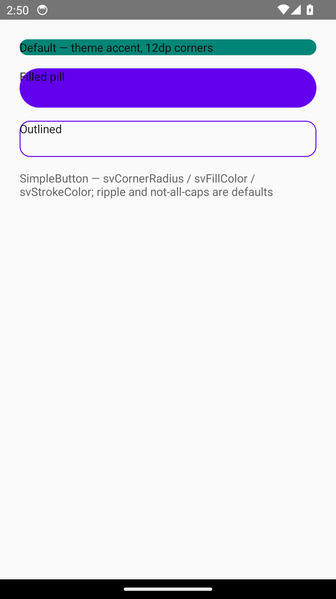

```xml
<com.github.simpleviews.SimpleButton
    android:id="@+id/submit"
    android:layout_width="match_parent"
    android:layout_height="48dp"
    android:text="Sign up"
    app:svCornerRadius="24dp"
    app:svFillColor="@color/purple" />
```

```kotlin
submit.setOnClickListener {
    submit.loading = true
    api.signUp { submit.loading = false }
}
```

| Attribute | Type | Default | Description |
|---|---|---|---|
| `svCornerRadius` | dimension | 12dp | Corner radius |
| `svFillColor` | color\|reference | theme accent | Fill color |
| `svPressedColor` | color\|reference | fill darkened 15% | Ripple highlight |
| `svStrokeColor` | color\|reference | transparent | Outline color |
| `svStrokeWidth` | dimension | 0 | Outline width |

Notes:
- `android:text`, `android:onClick`, `android:textSize` etc. all work — it
  *is* a Button.
- Text is **not** all-caps by default (set `android:textAllCaps="true"` to
  restore).
- `loading = true` saves the label, hides it, spins a painted arc, and makes
  `performClick()` a no-op. The state survives rotation.

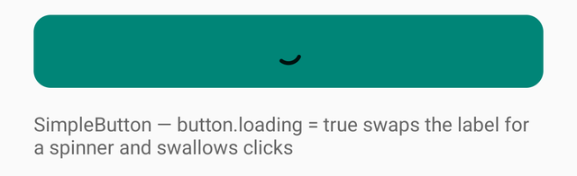

### PasswordEditText

A password field with the show/hide eye built in. The cursor position survives
the input-type switch, and the visibility state survives rotation. No
TextInputLayout, no Material dependency.

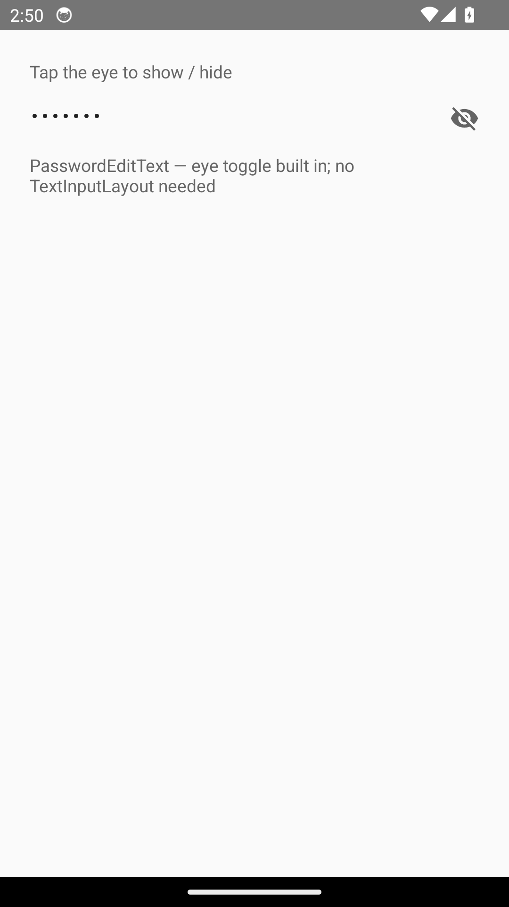

```xml
<com.github.simpleviews.PasswordEditText
    android:layout_width="match_parent"
    android:layout_height="wrap_content"
    android:hint="Password" />
```

```kotlin
password.showPassword = true   // or let the user tap the eye
```

Do **not** set `android:inputType` — the component manages it. `android:hint`
works normally.

### ValidatingEditText

Declarative validation rules in XML; one call to check and show an error.

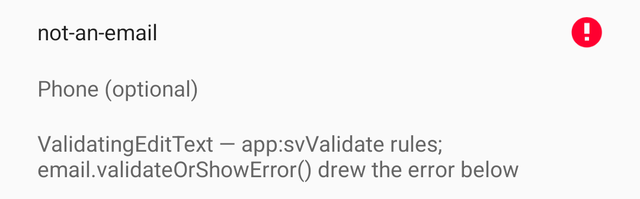

```xml
<com.github.simpleviews.ValidatingEditText
    android:id="@+id/email"
    android:layout_width="match_parent"
    android:layout_height="wrap_content"
    android:hint="Email"
    android:inputType="textEmailAddress"
    app:svValidate="required|email" />
```

```kotlin
if (email.validateOrShowError() && password.validateOrShowError()) {
    submit()
}
```

| Attribute | Type | Default | Description |
|---|---|---|---|
| `svValidate` | flags | none | Combine: `required`, `email`, `phone`, `number` |
| `svMinLength` | integer | 0 | Minimum character count |
| `svErrorMessage` | string | — | Overrides the built-in message |

Notes:
- Error messages are library string resources (`sv_error_required`,
  `sv_error_email`, …) — override them in your app to localize.
- `isValid()` checks without showing errors; `onValidityChanged` fires on
  every text change.

---

## Containers & feedback

### SimpleCard

A rounded, elevatable, borderable container whose children are clipped to the
corners. All framework drawing — no CardView, no Material.

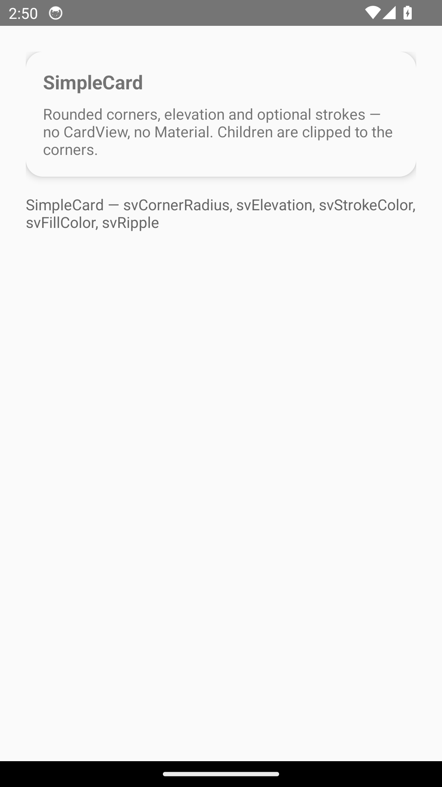

```xml
<com.github.simpleviews.SimpleCard
    android:layout_width="match_parent"
    android:layout_height="wrap_content"
    app:svCornerRadius="16dp"
    app:svElevation="4dp"
    app:svStrokeColor="#EEEEEE">

    <!-- any children -->
</com.github.simpleviews.SimpleCard>
```

| Attribute | Type | Default | Description |
|---|---|---|---|
| `svCornerRadius` | dimension | 12dp | Corner radius (clips children too) |
| `svFillColor` | color\|reference | theme background | Fill color |
| `svStrokeColor` | color\|reference | transparent | Outline color |
| `svStrokeWidth` | dimension | 0 | Outline width |
| `svElevation` | dimension | 0 | Shadow elevation |
| `svRipple` | boolean | false | Ripple on touch (for clickable cards) |

### BannerView

A colored one-line message bar: info, success, warning or error, optionally
dismissible.

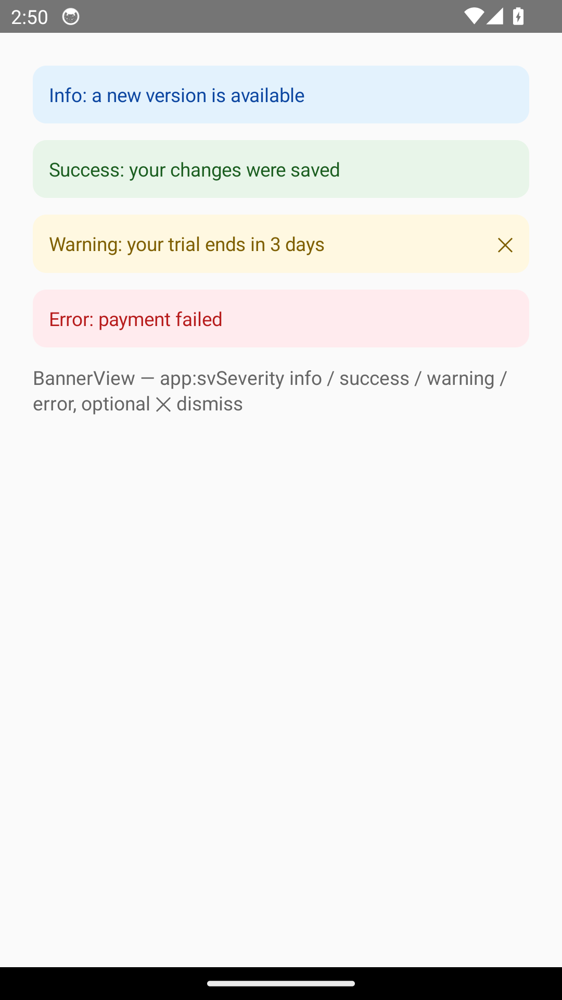

```xml
<com.github.simpleviews.BannerView
    android:layout_width="match_parent"
    android:layout_height="wrap_content"
    app:svSeverity="warning"
    app:svMessage="Your trial ends in 3 days"
    app:svDismissible="true" />
```

| Attribute | Type | Default | Description |
|---|---|---|---|
| `svSeverity` | enum | info | `info` `success` `warning` `error` |
| `svMessage` | string | — | The message |
| `svDismissible` | boolean | false | Shows an ✕ button |

```kotlin
banner.onDismissed = { track("banner_dismissed") }
banner.setMessage("Updated at noon")
```

Colors are fixed pastel pairs (theme-independent by design).

### EmptyStateView

The classic "nothing here" screen: icon, title, message and optional button,
centered and padded.

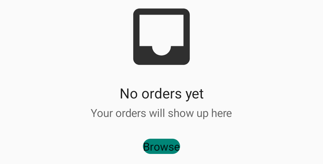

```xml
<com.github.simpleviews.EmptyStateView
    android:layout_width="match_parent"
    android:layout_height="match_parent"
    app:svIcon="@drawable/ic_orders"
    app:svTitle="No orders yet"
    app:svMessage="Your orders will show up here"
    app:svButtonText="Browse" />
```

```kotlin
emptyState.onButtonClickListener = { openCatalog() }
```

| Attribute | Type | Default | Description |
|---|---|---|---|
| `svIcon` | reference | built-in box icon | Icon above the title |
| `svTitle` | string | — | Title (hidden when absent) |
| `svMessage` | string | — | Message (hidden when absent) |
| `svButtonText` | string | — | Button label (button hidden when absent) |

### CenterLayout

A FrameLayout that centers its children. No `layout_gravity` needed.

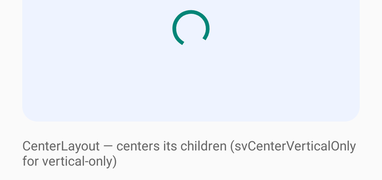

```xml
<com.github.simpleviews.CenterLayout
    android:layout_width="match_parent"
    android:layout_height="200dp">

    <ProgressBar
        android:layout_width="wrap_content"
        android:layout_height="wrap_content" />
</com.github.simpleviews.CenterLayout>
```

| Attribute | Type | Default | Description |
|---|---|---|---|
| `svCenterVerticalOnly` | boolean | false | Keep horizontal positions, center vertically |

### SafeLayout

A root layout that pads itself by the status/navigation bar insets. This is
the one-line fix for Android 15's enforced edge-to-edge, where old layouts
suddenly draw under the clock. User padding (`android:padding`) is preserved
and the insets are added on top.

```xml
<com.github.simpleviews.SafeLayout
    android:layout_width="match_parent"
    android:layout_height="match_parent"
    app:svFitSystemBars="both">

    <!-- your content, never under the status bar -->
</com.github.simpleviews.SafeLayout>
```

| Attribute | Type | Default | Description |
|---|---|---|---|
| `svFitSystemBars` | enum | both | `none` `top` `bottom` `both` |

---

## Layout stacks

### VStack

The vertical stack this library exists for: **children are normalized** to
full-width, wrap-height, with a uniform gap. No `layout_width`, no
`layout_height`, no margins — the two most annoying XML chores, gone.

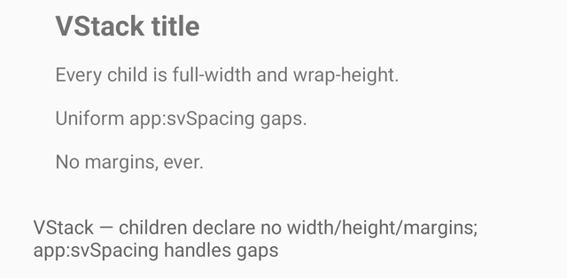

```xml
<com.github.simpleviews.VStack
    android:layout_width="match_parent"
    android:layout_height="wrap_content"
    android:padding="16dp"
    app:svSpacing="12dp">

    <TextView android:text="Title" android:textSize="22sp"
        android:layout_width="wrap_content" android:layout_height="wrap_content" />
    <TextView android:text="Body"
        android:layout_width="wrap_content" android:layout_height="wrap_content" />
    <Button android:text="Continue"
        android:layout_width="wrap_content" android:layout_height="wrap_content" />
</com.github.simpleviews.VStack>
```

| Attribute | Type | Default | Description |
|---|---|---|---|
| `svSpacing` | dimension | 0 | Gap between children (never at the edges) |
| `svExactSize` (per child) | boolean | false | Opt a child out of normalization |

Notes:
- Android still forces children to *declare* `layout_width`/`layout_height` —
  write `wrap_content` everywhere; VStack overrides whatever it finds.
- Margins on children are overridden by the spacing system (per-child margin
  tweaks get lost — use a wrapper or `svExactSize`).
- Gaps recompute on add/remove, so no phantom gap is left at the bottom.

```kotlin
vstack.spacing(12)               // change the gap from code
```

### HStack

The horizontal sibling: children normalized to wrap/wrap with a uniform gap,
or stretched to equal widths.

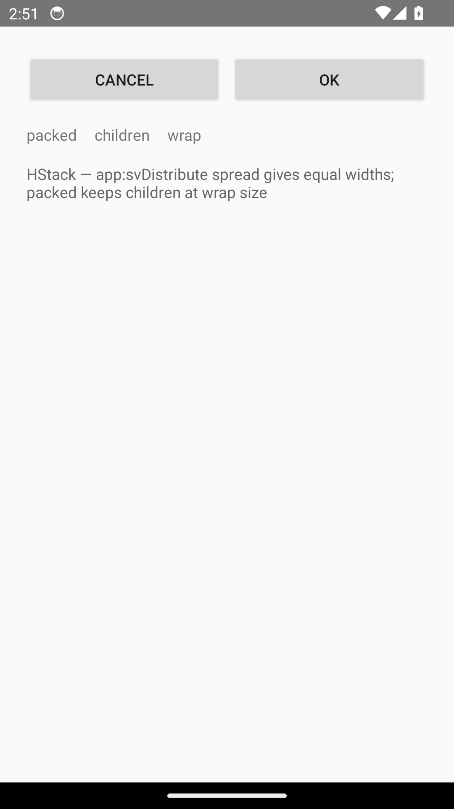

```xml
<com.github.simpleviews.HStack
    android:layout_width="match_parent"
    android:layout_height="wrap_content"
    app:svDistribute="spread"
    app:svSpacing="8dp">

    <Button android:text="Cancel"
        android:layout_width="wrap_content" android:layout_height="wrap_content" />
    <Button android:text="OK"
        android:layout_width="wrap_content" android:layout_height="wrap_content" />
</com.github.simpleviews.HStack>
```

| Attribute | Type | Default | Description |
|---|---|---|---|
| `svSpacing` | dimension | 0 | Gap between children |
| `svDistribute` | enum | packed | `packed` = children at wrap size; `spread` = equal widths (weight 1) |

### ScrollVStack

A scrollable VStack. Children are declared directly on it and routed to the
internal stack — which makes the infamous *"ScrollView can host only one
direct child"* crash impossible.

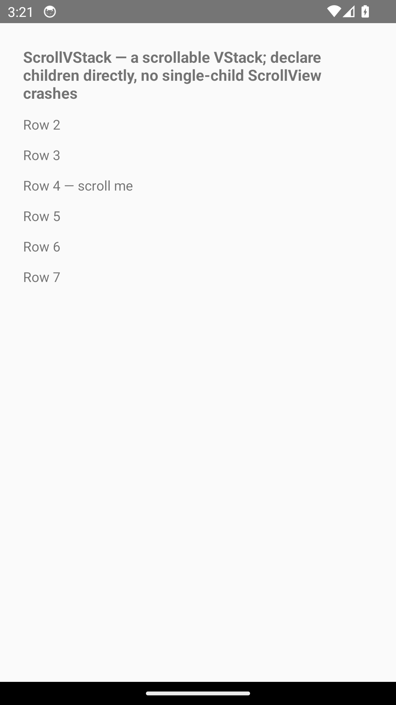

```xml
<com.github.simpleviews.ScrollVStack
    android:layout_width="match_parent"
    android:layout_height="match_parent"
    android:padding="16dp"
    app:svSpacing="12dp">

    <!-- any number of children -->
</com.github.simpleviews.ScrollVStack>
```

| Attribute | Type | Default | Description |
|---|---|---|---|
| `svSpacing` | dimension | 0 | Gap between children |
| `svFillViewport` | boolean | true | Content stretches to fill when short |

---

## Pre-built page templates

These are composite views: one self-closing tag, everything driven by
attributes. They cover the screens every tutorial app ends up hand-building.

### ImagePage

Web image on top, caption under it, centered and padded — with an optional
button. The "image + caption" screen in one tag.

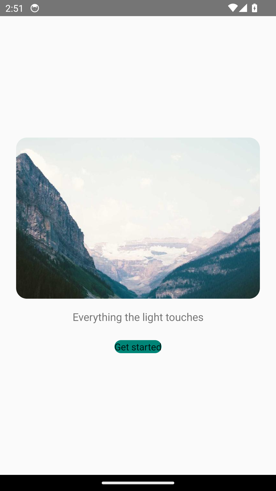

```xml
<com.github.simpleviews.ImagePage
    android:layout_width="match_parent"
    android:layout_height="match_parent"
    app:svImageUrl="https://picsum.photos/900/500"
    app:svText="Everything the light touches"
    app:svButtonText="Get started"
    app:svCentered="true" />
```

| Attribute | Type | Default | Description |
|---|---|---|---|
| `svImageUrl` | string | — | Image URL |
| `svText` | string | — | Caption (hidden when absent) |
| `svImageHeight` | dimension | 240dp | Image height |
| `svImageCornerRadius` | dimension | 0 | Rounded image corners |
| `svPadding` | dimension | 24dp | Page padding |
| `svCentered` | boolean | false | Center content within the page |
| `svButtonText` | string | — | Optional button (hidden when absent) |

```kotlin
page.onButtonClick = { openOnboarding() }
page.setCaption("Updated caption")
```

### TitlePage

Splash / onboarding screen: big title, subtitle, optional button, vertically
centered.

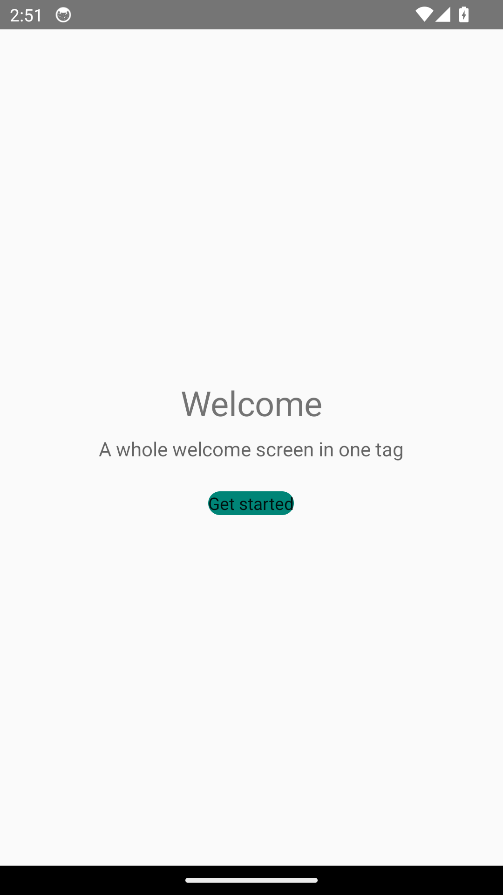

```xml
<com.github.simpleviews.TitlePage
    android:layout_width="match_parent"
    android:layout_height="match_parent"
    app:svTitle="Welcome"
    app:svSubtitle="The simplest UI library for Android"
    app:svButtonText="Get started" />
```

| Attribute | Type | Default | Description |
|---|---|---|---|
| `svTitle` | string | — | Large title |
| `svSubtitle` | string | — | Secondary line |
| `svButtonText` | string | — | Optional button |

```kotlin
titlePage.onButtonClick = { startActivity<NextActivity>() }
```

### ProfileHeader

Avatar + name + subtitle + optional right-side action link.

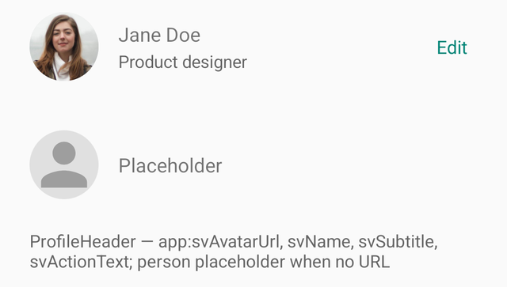

```xml
<com.github.simpleviews.ProfileHeader
    android:layout_width="match_parent"
    android:layout_height="wrap_content"
    app:svAvatarUrl="https://example.com/me.jpg"
    app:svName="Jane Doe"
    app:svSubtitle="Product designer"
    app:svActionText="Edit" />
```

| Attribute | Type | Default | Description |
|---|---|---|---|
| `svAvatarUrl` | string | — | Avatar image URL (person placeholder if absent) |
| `svName` | string | — | Display name |
| `svSubtitle` | string | — | Line under the name |
| `svActionText` | string | — | Right-side link (hidden when absent) |

```kotlin
profileHeader.onActionClick = { openEditor() }
```

### ListItemView

The settings-row workhorse: icon (resource *or* URL), title, optional
subtitle, optional right-side value, chevron, full-width ripple and optional
divider.

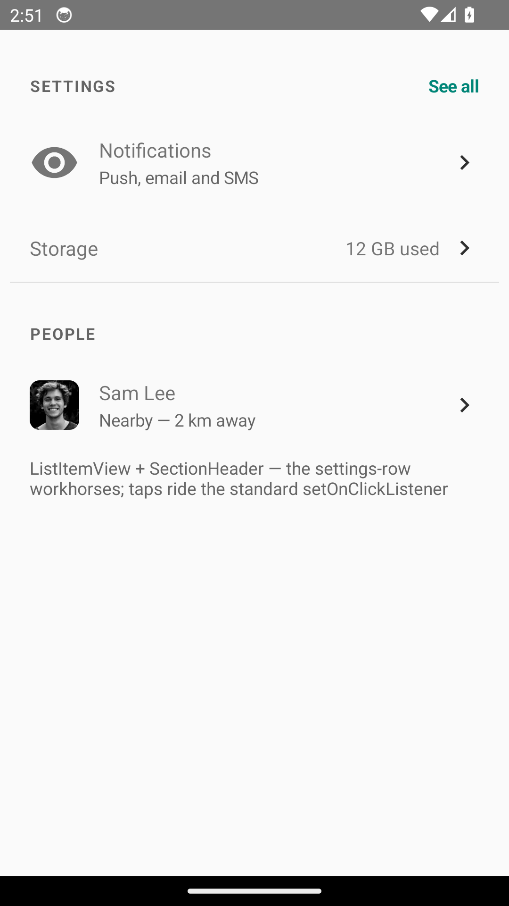

```xml
<com.github.simpleviews.ListItemView
    android:layout_width="match_parent"
    android:layout_height="wrap_content"
    app:svIcon="@drawable/ic_notifications"
    app:svTitle="Notifications"
    app:svSubtitle="Push, email and SMS"
    app:svDivider="true" />
```

| Attribute | Type | Default | Description |
|---|---|---|---|
| `svIcon` | reference | — | Leading icon drawable |
| `svIconUrl` | string | — | Leading icon from a URL (used if `svIcon` absent) |
| `svTitle` | string | — | Row title |
| `svSubtitle` | string | — | Line under the title |
| `svValue` | string | — | Right-side value text |
| `svChevron` | boolean | true | Right chevron arrow |
| `svDivider` | boolean | false | Bottom hairline |

```kotlin
row.setOnClickListener { openNotifications() }
```

### SectionHeader

A small uppercase section label with an optional right-side action link.

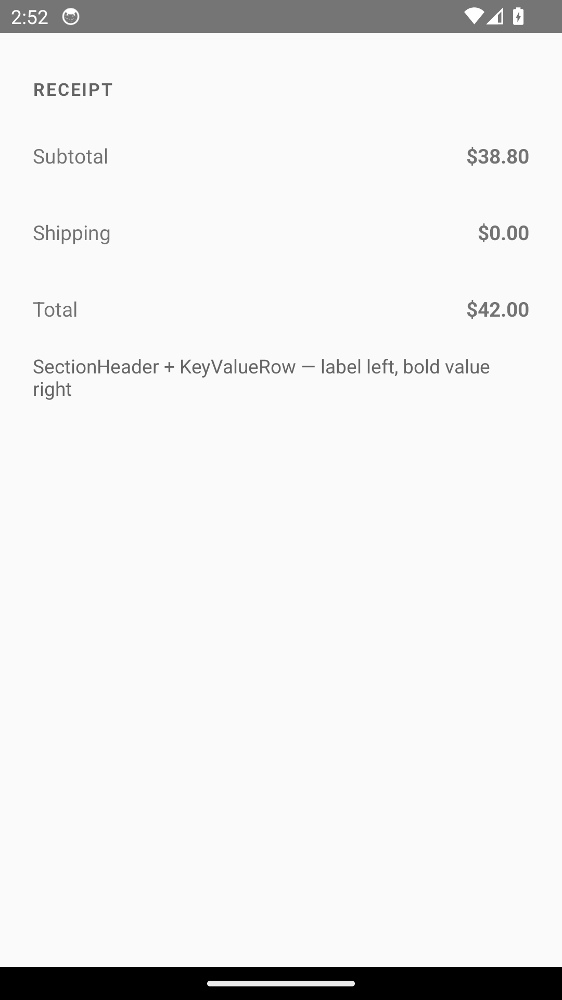

```xml
<com.github.simpleviews.SectionHeader
    android:layout_width="match_parent"
    android:layout_height="wrap_content"
    app:svTitle="Account"
    app:svActionText="See all" />
```

| Attribute | Type | Default | Description |
|---|---|---|---|
| `svTitle` | string | — | Section label (rendered uppercase) |
| `svActionText` | string | — | Right-side link (hidden when absent) |

```kotlin
sectionHeader.onActionClick = { showAll() }
```

### KeyValueRow

Label left, bold value right — the detail-screen row.


```xml
<com.github.simpleviews.KeyValueRow
    android:layout_width="match_parent"
    android:layout_height="wrap_content"
    app:svLabel="Order total"
    app:svValue="$42.00" />
```

| Attribute | Type | Default | Description |
|---|---|---|---|
| `svLabel` | string | — | Left label |
| `svValue` | string | — | Right value |

```kotlin
row.setValue("$57.20")
```

### BottomActionBar

Your content plus a full-width button pinned to the bottom — the login /
onboarding pattern without nested ScrollViews. Anything declared inside the
tag becomes the content area.

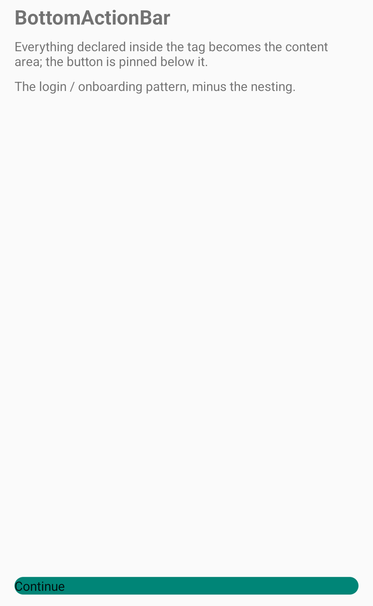

```xml
<com.github.simpleviews.BottomActionBar
    android:layout_width="match_parent"
    android:layout_height="match_parent"
    app:svButtonText="Continue">

    <TextView android:text="Terms apply"
        android:layout_width="wrap_content" android:layout_height="wrap_content" />
</com.github.simpleviews.BottomActionBar>
```

| Attribute | Type | Default | Description |
|---|---|---|---|
| `svButtonText` | string | — | Button label (button hidden when absent) |

```kotlin
bottomBar.onButtonClick = { advance() }
// bottomBar.content  — the FrameLayout holding your children
// bottomBar.button   — the SimpleButton itself
```

---

## Lists

### SimpleList

The RecyclerView complexity bomb, defused. No adapter, no ViewHolder, no
LayoutManager, no DiffUtil — just data in, rows out. Pull-to-refresh and empty
states are attributes.

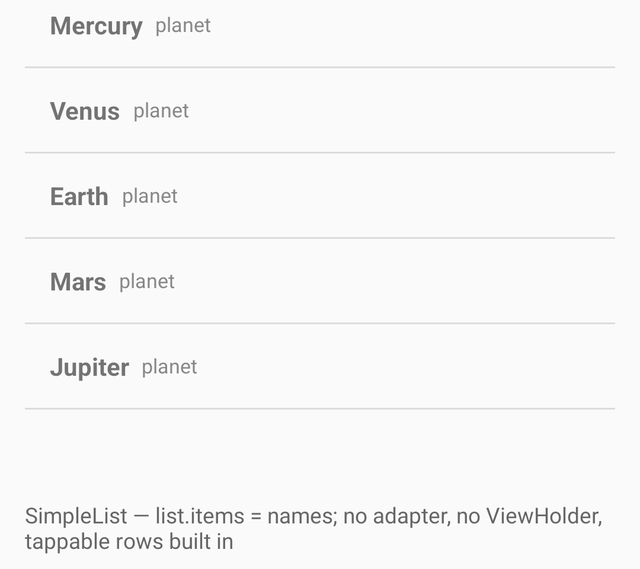

```xml
<com.github.simpleviews.SimpleList
    android:id="@+id/list"
    android:layout_width="match_parent"
    android:layout_height="match_parent"
    app:svItemLayout="@layout/row_person"
    app:svEmptyText="No people found"
    app:svDivider="true"
    app:svPullToRefresh="true" />
```

```kotlin
// One line for a working list of anything (default row shows toString()):
list.items = listOf("Mercury", "Venus", "Earth")

// Custom rows — still no adapter boilerplate:
list.submit(people) { row, person, _ ->
    row.findViewById<TextView>(R.id.name).text = person.name
    row.findViewById<TextView>(R.id.role).text = person.role
}
list.onItemClick = { person, _ -> open(person) }

// Pull-to-refresh (spinner stops itself when the block returns):
list.onRefresh {
    list.submit(api.reloadPeople())
}

// Clearing the list shows the built-in empty message:
list.items = emptyList()
```

| Attribute | Type | Default | Description |
|---|---|---|---|
| `svItemLayout` | reference | simple list item | Layout inflated per row |
| `svEmptyText` | string | — | Message shown when `items` is empty |
| `svDivider` | boolean | false | Row dividers (linear lists) |
| `svPullToRefresh` | boolean | false | Enables the swipe gesture |
| `svOrientation` | enum | vertical | `vertical` or `horizontal` |
| `svColumns` | integer | 1 | ≥ 2 switches to a grid |
| `svItemSpacing` | dimension | 0 | Spacing between rows/cells |

| Property / function | Description |
|---|---|
| `items: List<Any>` | Replace the data; list refreshes and empty state updates |
| `submit(list) { row, item, pos -> }` | Type-safe one-call data + bind |
| `itemLayoutRes: Int` | Row layout at runtime |
| `emptyText: String?` | Empty message at runtime |
| `onBind: (View, Any, Int) -> Unit` | Row binder |
| `onItemClick: (item: Any, pos: Int) -> Unit` | Row taps |
| `onRefresh { }` | Pull-to-refresh callback |
| `recyclerView` | Escape hatch to the underlying RecyclerView |

Notes:
- Default bind: if `itemLayout` is a single TextView (like the built-in
  `android.R.layout.simple_list_item_1`), rows render `item.toString()` with
  no binder at all.
- With `svColumns ≥ 2` you get a grid; dividers are skipped there.
- Under the hood it's `notifyDataSetChanged` — deliberately simple, exactly
  as advertised.

---

## Other views

### HtmlTextView

Rich text from XML, links included and clickable.

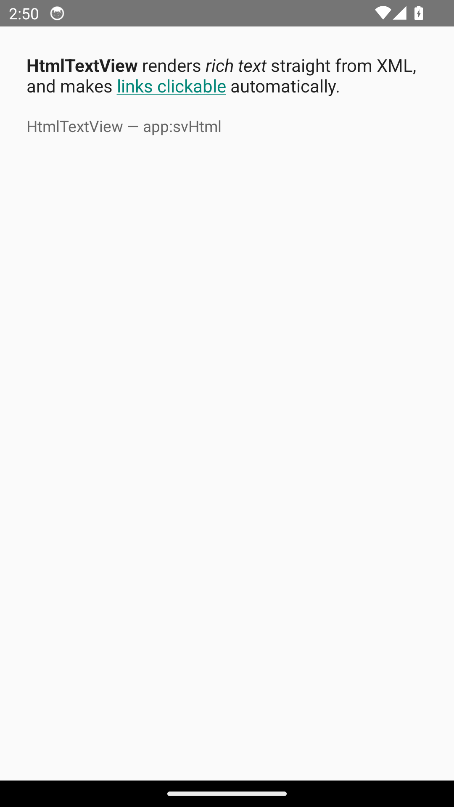

```xml
<com.github.simpleviews.HtmlTextView
    android:layout_width="match_parent"
    android:layout_height="wrap_content"
    app:svHtml="&lt;b&gt;Bold&lt;/b&gt;, &lt;i&gt;italic&lt;/i&gt; and a &lt;a href=&quot;https://example.com&quot;&gt;link&lt;/a&gt;." />
```

```kotlin
textView.setHtml("<b>Hello</b>")
```

| Attribute | Type | Default | Description |
|---|---|---|---|
| `svHtml` | string | — | HTML to render (needs XML-escaped `<` as `&lt;`) |

### SimpleWebView

A WebView that loads its URL from XML, JavaScript on by default.

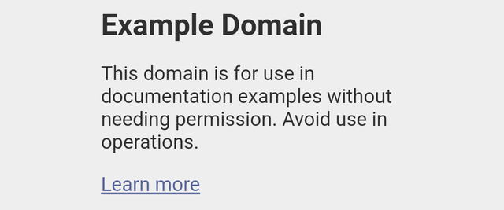

```xml
<com.github.simpleviews.SimpleWebView
    android:layout_width="match_parent"
    android:layout_height="match_parent"
    app:svUrl="https://example.com" />
```

| Attribute | Type | Default | Description |
|---|---|---|---|
| `svUrl` | string | — | Page to load |
| `svJavaScriptEnabled` | boolean | true | JavaScript setting |

```kotlin
webView.goBackOrExit(this)   // wire this to your back handler
```

---

## Kotlin helpers

Not views — one file of extensions that remove daily boilerplate:

```kotlin
context.toast("Saved")
context.alert("Delete?", "This cannot be undone")
context.confirm("Delete?", "Are you sure?") { delete() }

view.visible()
view.gone()
view.invisible()

activity.hideKeyboard()
```

---

## The svExactSize escape hatch

VStack / HStack / ScrollVStack normalize their children (that's the point).
When a child must keep its declared size — a fixed-height image, a weighted
view, a `match_parent` child — set one attribute on the **child**:

```xml
<com.github.simpleviews.VStack ...>
    <com.github.simpleviews.UrlImageView
        android:layout_width="match_parent"
        android:layout_height="240dp"
        app:svExactSize="true"          <!-- keeps 240dp instead of wrap -->
        app:svLoad="https://…" />
</com.github.simpleviews.VStack>
```

---

## Attribute naming: why `sv…`?

Every custom attribute is prefixed (`app:svLoad`, `app:svSpacing`, …).
Generic names like `title` or `strokeWidth` are already declared by Material
Components and other popular libraries — same name with a different format
breaks the consumer's build during resource merging. The prefix makes
collisions impossible and autocompletion tidy.

## Design decisions

- **Everything declarable in XML**; every XML attribute has an identical
  property, and both funnel into one internal `render()` — XML and code can
  never drift apart.
- **Zero required custom attributes.** Every component renders something
  sensible with none set.
- **No Material Components.** Rounded corners, strokes, ripples and the
  button spinner are framework drawing (`GradientDrawable`, `RippleDrawable`,
  `ViewOutlineProvider`, `Canvas`).
- **Preview-friendly.** Components guard network work with `isInEditMode` and
  render placeholders in the layout editor.
- **Deliberately not performance-tuned.** Simple beats fast here:
  `notifyDataSetChanged`, per-bind `findViewById`, post-padding recompute on
  every child change.

## Sample app

The `sample` module is a living demo: a menu (itself a `SimpleList`) with one
screen per component, plus a `ShotActivity` harness that renders each
component in isolation (used to produce the screenshots above). Open the
project in Android Studio and run it.

## Publishing your fork

1. Change `groupId` in `library/build.gradle.kts` to `com.github.<your-username>`.
2. Push to GitHub and create a release tag (e.g. `1.0.0`). JitPack builds it
   on demand — `jitpack.yml` pins JDK 17 (required by AGP 8) and installs the
   compile SDK platform.
3. Check the build at https://jitpack.io/#KevinLay689/SimpleViews.

## License

MIT — see [LICENSE](LICENSE).
